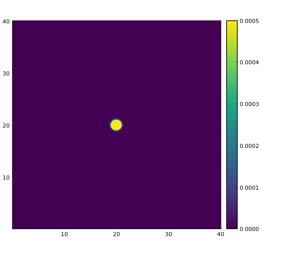

# Julia Lattice Boltzmann

Julia implementation of the standard Lattice Bhatnagar-Gross-Krook (LGBK) approach on a periodic D2Q9 discretised grid.

Created as a personal weekend project to learn more about Lattice Boltzmann methods, and also to learn more about programming high performance code in Julia. The main iteration loop is entirely allocation free. The main script runs a simple wave propogation problem with an initial density perturbation in the middle of the domain.

I hope that the simplicity of the code can make it serve as a learning resource for others.

